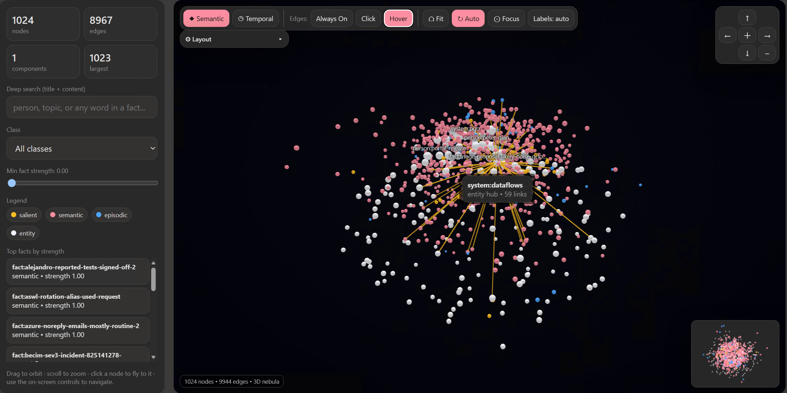

# dreamweave

**A nightly memory engine for [OpenClaw](https://github.com/openclaw/openclaw)-based agents (including Microsoft Scout / Clawpilot).**

Most agent memory is a flat text file that grows unbounded and gets RAG'd. **dreamweave** is different: your agent *dreams*. A nightly pass **weaves a brain-faithful graph+vector memory** and consolidates it like sleep — a forgetting curve drops noise, duplicates **merge**, and survivors **weave** into one connected graph — across three tiers (instinct / recall / archive). The **recall** path then answers with semantic vector search **plus graph-neighbor expansion**.

<p align="center">
  
</p>
<p align="center"><em>Your memory, alive: explore facts, entities, temporal structure, and activated connections in the 3D semantic nebula.</em></p>

What makes it different from other "dream"/memory skills:

- **Graph + vector, not flat RAG** — entities and facts with edges; recall returns *neighbors*, which is what actually helps synthesis. The **weave** is the signature operation.
- **Three tiers** — instinct (~500 injected gist) / recall (~2,500 graph+vector) / archive (uncapped bookshelf). It bounds what's **injected**, not what's **remembered**.
- **Brain-faithful consolidation** — forgetting curve, REM-style merge, temporal sequencing, demote-don't-delete.
- **Bounded nightly cost** — incremental weave + embed-once, so it's genuinely runnable *every* night, forever.
- **Benchmarked** — measured on the [Recall Bench](https://github.com/Stevenic/recall), not vibes.

The engine runtime is **local and free**: SQLite (`better-sqlite3`) + `sqlite-vec` for the vector index,
and `@huggingface/transformers` for on-device embeddings (`all-MiniLM-L6-v2`, 384-dim). It has no
provider client or API-key requirement; nightly judgment is supplied by the host agent. Ships with
a 3D **semantic nebula explorer** to inspect the store.

> **Not affiliated with, authorized, or endorsed by Microsoft.** This is an independent, community
> project. "Microsoft Scout" and related names are trademarks of their respective owners and are
> referenced only to describe compatibility.

---

## Why

Most agents store memory as a growing list of text snippets and retrieve with naive similarity.
That fails two ways at scale: the bank **grows unbounded** (blowing the context budget and diluting
attention), and facts sit **disconnected** (so retrieval can't hop between related facts). This
package fixes both:

- **FORGET** — a forgetting curve decays stale facts; noise evaporates, durable facts persist.
- **MERGE** — duplicate/over-lapping facts collapse into fewer, richer entries (count down, info kept).
- **WEAVE** — every surviving fact is connected into one graph via shared entities, so recall can
  traverse and attention can bind related facts.

The result is a bounded projection (~250-entry standard target) backed by a larger tiered,
atomic, **fully connected** memory store.

> **Design guideline:** the engine follows a **three-tier memory model** (instincts /
> RAG / bookshelf) with a few non-negotiable principles (embed-once, bounded nightly
> cost, demote-don't-delete, gist-for-attention/detail-for-recall). Start with
> [`docs/FIRST-PRINCIPLES.md`](docs/FIRST-PRINCIPLES.md) (why), then
> [`docs/ARCHITECTURE.md`](docs/ARCHITECTURE.md) (the design) and
> [`docs/JOURNEY.md`](docs/JOURNEY.md) (how we got here) before making engine changes.

### Host judgment layer

The engine is **local-only and has no external-LLM client**. It performs embeddings, decay,
graph maintenance, candidate generation, and decision application locally. For judgments a
regex cannot make, it emits bounded `report-*` JSON; the host agent reads that report and returns
decision JSON to the matching `apply-*` command.

The caller judges five surfaces in order: entities, aliases, salience, merges, and synthesis.
The model is a **judge, not an author**: decisions may only type, group, score, or consolidate
content present in the report. This keeps provider credentials and model choice outside the
engine and gives the live harness and evaluation harness one shared execution path.

---

## Architecture (one minute)

- **`memory.db`** (SQLite + `sqlite-vec`) is the durable source of truth and retrieval index.
- Two node kinds:
  - **fact** — an atomic memory (`kind='fact'`), carries a forgetting-curve `strength`, **projects
    back to your agent's memory bank**.
  - **entity** — a connector hub (`person:`/`team:`/`system:`/…), no decay, **never projects**;
    pure graph scaffolding that links facts so nothing is an island.
- A parallel `vec_nodes` (vec0, cosine, 384-dim) holds each node's embedding.
- The **host agent's memory bank is a disposable nightly projection** of the db. Daytime, the agent
  adds memories normally; the nightly **dream** ingests them, consolidates, and projects the curated
  set back.

```
  your agent's memories  ──dump──▶  snapshot.json
                                      │ ingest
                                      ▼
                                 memory.db  ──dream / weave / reflect / consolidate──▶  memory.db
                                      │ export-harness (diff)
                                      ▼
                          add/remove memories in the agent
```

---

## Install

Requirements: **Node ≥ 18** and a toolchain that can build `better-sqlite3` (prebuilt binaries cover
most platforms; otherwise you need Python + a C++ compiler).

### Option A — download a release zip (recommended for users)

Grab the latest `dreamweave-vX.Y.Z.zip` from the [**Releases**](https://github.com/spqian/dreamweave/releases)
page, unzip it, and tell your OpenClaw/Scout agent to *"import this"* — it detects
[`INSTALL.md`](INSTALL.md) and runs the whole setup (install deps, create the store, install the
`dream` + `graph-recall` skills, then interview you on the four behavioral knobs). Or do it by hand:

```bash
cd dreamweave-vX.Y.Z
npm install
npm run setup
```

> Release zips are built and published automatically by [`.github/workflows/release.yml`](.github/workflows/release.yml)
> whenever a `vX.Y.Z` tag is pushed. They are **source-only** — the native deps are built by your
> `npm install`. Maintainers can build the same zip locally with `npm run pack`.

### Option B — clone the repo (for development)

```bash
cd dreamweave
npm install
npm run setup
```

`npm run setup` verifies dependencies, creates the data dir, initializes a fresh `memory.db` with the
full schema, and warms the embedding model (first run downloads ~90 MB once, then it's cached).

### Where data lives (all overridable)

| Env var | Default | What |
| --- | --- | --- |
| `AGENT_MEMORY_DIR` | `~/.agent-memory` | per-user data dir (db, model cache, rendered viz) |
| `MEMORY_DB` | `<dir>/memory.db` | the SQLite store |
| `MEMORY_VIZ` | `<dir>/memory-graph.html` | rendered 3D explorer output |
| `MEMORY_MODEL_CACHE` | `<dir>/model-cache` | embedding model weights |
| `MEMORY_MODEL` | `Xenova/all-MiniLM-L6-v2` | embedding model id |
| `MEMORY_EMBED_DIM` | `384` | embedding dimensionality (must match the model) |

To co-locate with a host agent's data dir, set `AGENT_MEMORY_DIR` to it (e.g. `~/.copilot/data`).

---

## Usage

### Recall (read path)

```bash
node src/recall.js --query "who owns the gateway release" --max-hops 2
```

Returns semantic seeds (cosine similarity) plus a connected cluster (nodes + typed edges) for the
agent to ground an answer on. Drives the **`graph-recall`** skill.

### The nightly dream (maintenance path)

Run these in order (the **`dream`** skill orchestrates them with the host's memory tools):

```bash
# 1. WAKE: dump your agent's memories to snapshot.json  →  [{ id, fact, category }]
#    category ∈ decision | fact | context | preference  (a DISPLAY label only)
#    NB: category no longer sets the memory class — every ingested memory enters EPISODIC;
#    the nightly dream EARNS semantic durability through reactivation and assigns
#    continuous salience_score importance only through the salience judgment surface.

# 2. INGEST + verify (lossless, memory_id-keyed)
node src/dream.js ingest-harness --file snapshot.json
node src/dream.js verify-sync   --file snapshot.json   # exit 3 if any memory is missing

# 3. DREAM: pre-weave, decay, reactivate, evaporate, housekeeping
node src/dream.js dream

# 4. REPORT → HOST JUDGES → APPLY, in this order:
#    entities, aliases, salience, merges, synthesis
node src/dream.js report-entities --as-of <iso>
node src/dream.js apply-entities --file decisions.json --as-of <iso>
#    ...repeat for aliases, salience, merges, synthesis
#    For merges, preserve the report identity:
#    report-merges -> { report_id, clusters }
#    apply-merges file -> { report_id, decisions:[...] }
#    Merge apply is all-or-nothing and exits 3 with structured rejections if
#    any submitted decision is stale, overlapping, or spans report clusters.

# 5. HEALTH: connect post-judgment changes and verify invariants
node src/dream.js weave --as-of <iso>
node src/dream.js doctor              # exit 3 on islands/dangling/vector defects

# 6. PROJECT: export the curated facts back to the agent's bank (apply the diff)
node src/dream.js export-harness

# 7. VIZ
node src/dream.js export-viz          # renders $MEMORY_VIZ
```

Helpers: `node src/dream.js stats` · `budget` (entry-count pressure + forecast) · `init` (just create
the db).

See **`skills/dream/SKILL.md`** for the full algorithm (strength model, schema-accelerated
consolidation, the projection budget, salience rules) and **`skills/graph-recall/SKILL.md`** for the
recall contract. Those two files are the agent-facing instructions.

---

## The 3D explorer

`export-viz` renders a self-contained HTML explorer (`$MEMORY_VIZ`) plus its vendored engine next to
it. Open the file in any browser. Features: a hub-anchored graph layout with a linear semantic
projection fallback, color = episodic/semantic durability plus continuous salience highlighting,
white balls for entity hubs, deep search over title+content,
click-to-focus with 2-hop pruning and a 3D "auto-dodge" that pushes irrelevant nodes out of view,
minimap, orbit controls, and smart auto-labeling. Append `?scoutTheme=dark` or `?scoutTheme=light`
to force a theme.

---

## Integrating with a host agent

The engine is **host-agnostic** — it only reads a snapshot JSON and writes an inject-ready export.
To wire it into an agent:

1. **Install the two skills.** Point your agent at `skills/dream/` and `skills/graph-recall/`
   (copy or symlink into wherever it loads skills from). They reference the engine as
   `node <AGENT_MEMORY>/src/dream.js` / `src/recall.js`.
2. **Map the memory tools.** The dream algorithm uses three host operations — *list all memories*,
   *add a memory*, *remove a memory*. Substitute your agent's equivalents (the SKILL.md uses Microsoft
   Scout's `m_list_memories` / `m_remember` / `m_forget` as the reference).
3. **Schedule it.** Run the nightly loop on a timer (cron / the agent's scheduler).
4. **Co-locate data** via `AGENT_MEMORY_DIR` if you want the store beside the agent's other state.

---

## Layout

```
agent-memory/
  config.js                 # env-overridable paths + model config
  setup.js                  # one-command bootstrap
  package.json
  src/
    dream.js                # the consolidation engine (all subcommands)
    recall.js               # vector + graph recall (read path) — temporal parsing/tokenization via langsvc
    embed.js                # local embeddings (transformers.js)
    entities.js             # backward-compat shim (re-exports sig-utils + default langsvc)
    sig-utils.js             # generic "type:slug" signature parsing (labelOf/typeOf/buildVocab only)
    langsvc.js               # pluggable language-service loader/facade (no LLM, local, deterministic)
    langsvc.English.js       # default (English) service: entities, normalize/slug, temporal parsing,
                             #   tokenization/stopwords, query-shape detection, hard-specifics, age-tag, node prose
    timeline.js              # age-day math (generic) + ageTag/relAge facade (labels resolved via langsvc)
    graphtext.js            # neighbor-naming text for embeddings — facade over langsvc's renderNodeText
    schema.js               # fresh-db schema bootstrap
  viz/
    graph-store-visualization.html   # explorer template (empty data line)
    lib-3d-force-graph.min.js        # vendored 3D engine (MIT)
  skills/
    dream/SKILL.md          # nightly consolidation instructions (agent-facing)
    graph-recall/SKILL.md   # recall instructions (agent-facing)
```

---

## Licenses

MIT (this package). Bundled/declared dependencies: `3d-force-graph` (MIT), `better-sqlite3` (MIT),
`sqlite-vec` (MIT/Apache-2.0), `@huggingface/transformers` (Apache-2.0), and the
`all-MiniLM-L6-v2` model weights (Apache-2.0). Verify before redistribution.
